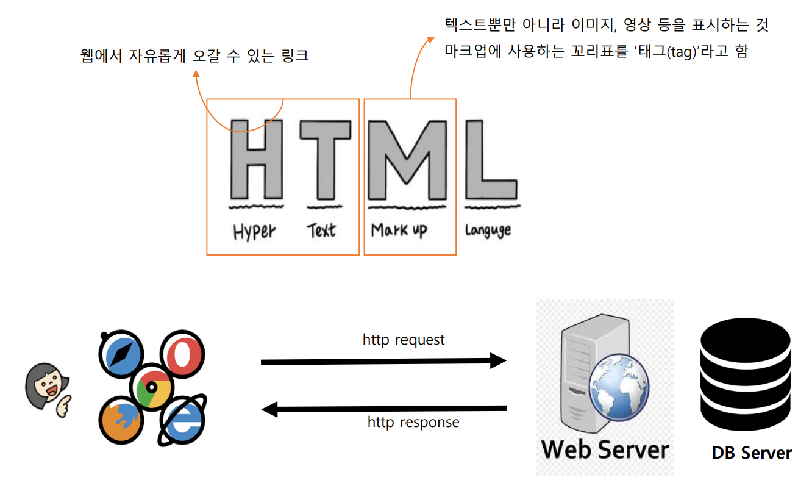
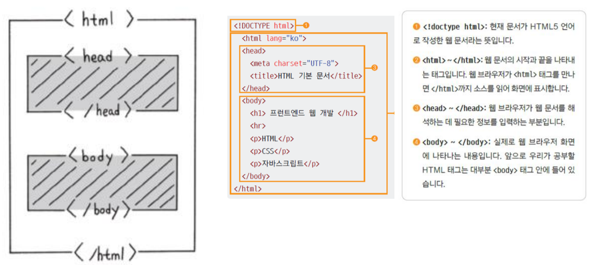

# HTML

## 단축키
- ! + tab(enter) : 기본 HTML 작성
- ctrl + s : 파일 저장
- ctrl + z : 이전으로 돌아가기
- ctrl + y : 원래 상태로 돌아가기
- tab : 오른쪽으로 4칸 이동
- shift + tab : 왼쪽으로 4칸 이동
- ctrl + / : 언어에 맞춰 주석 생성
- lorem + tab : 더미 text 생성
- alt + z : 자동 줄바꿈
- ctrl + alt + 화살표(아래) => 한줄 복사
- alt + 화살표 : 한줄 이동
- ctrl + d : 한줄 삭제
- alt + L + O : live server page 생성

## 웹 개발이란
### 클라이언트 개발
- 클라이언트
    - 사용자가 웹 사이트에 접근할 때 사용하는 기기
    - 심플하게 정의하면 웹 브라우저(폰,PC)
- 프런트엔드 개발
    - 웹 브라우저 화면에 보이는 부분을 다룸
    - HTML, CSS, 자바스크립트 사용
### 백앤드 개발
- 서버
    - 인터넷에 연결된 컴퓨터. 성능이 좋은 컴퓨터를 사용
    - 서비스 제공을 위해 많은 정보가 저장
- 백엔드 개발
    - 사용자 뒤(back)에서 보이지 않는 영역, 즉 서버를 다룸
    - 파이썬, 자바, PHP 등 프로그래밍 언어 사용
    - 데이터베이스를 설계하거나 데이터 처리

## 웹 개발을 위해 공부해야 할 기술 – HTML/CSS
- HTML로는 웹 사이트의 내용을 구조화 CSS로는 웹 문서의 디자인을 구성
- 스타일을 사용하면 웹 문서의 내용과 상관없이 디자인만 바꿀 수 있다

## HTML 이란

 HTML(hyper text markup language)   
클라이언트가 서버에 http에 맞추어 요청을 했을 때
서버가 문서를 구조화하기 위해 응답을 하는데
이 때 문서를 구조화하기 위해 사용하는 언어가 HTML이다
1. W3C사에서 권고안으로 개발되었다
    http://www.w3schools.com 
2. HTML 태그와 텍스트(데이터)로 구성된다
3. 태그는 구분자와 역할과 기능적 역할로 나눈다
4. 현재 개발 시점에서 기능적 역할은 거의 다 CSS에서 한다   

## HTML 문서의 기본 구조

### 브라우저에게 정보를 주는 `<head>` 태그
- 문서 관련 정보 입력, 웹 브라우저 화면에는 보이지 않음.
- 문서에서 사용할 외부 파일 링크

### 문자 세트 등 문서 정보가 들어 있는 `<meta>` 태그
- 한글로 된 내용을 표시하기 위해서 UTF-8 문자 세트를 사용
- 이외에도 다양한 문서 정보를 지정
    - http-equiv="X-UA-Compatible" content="IE=edge“ : MS IE 낮은 버전에서도 edge의 해석기를 가지고 페이지를 해석하라는 의미
    - viewport : 아이폰에서 사용, 브라우저의 width 크기를 devic로 크기로 설정, initial-scale=1.0은 100% 동일하게 설정
### 문서 제목을 나타내는 `<title>` 태그
- 페이지의 제목을 탭에 보여준다

### 웹 브라우저에 내용을 표시하는 <body> 태그
- 실제 브라우저에 표시될 내용 입력
- 대부분의 태그가 <body> 태그와 </body> 태그 사이에서 사용하는 태그들
- 브라우저의 주요 부분
- 주요한 태그만 알아두고, 나머지 태그는 사이트에서 참조하여 사용함 
- https://www.w3schools.com/tags/default.asp tag 정리되어있음

## HTTP protocol
- 

## Layout
- 데이터 구조(뼈대)
- 스타일을 입히는 것(선택)

## 정리
- 웹의 뼈대
- 클라이언트가 서버 http에 맞추어 요청을했을 때 서버가 문서를 구조화하여 응답
- HTML의 데이터를 구조화시키기 위해 tag를 사용
- HTML 역할: 기능, 데이터 구분자
- HTML 구성: 태그 안에 속성, 태그와 태그 사이에 텍스트, 태그 안에 태그
- 기능적 역할 -> w3school에서 찾아본다
    1. form 가장 중요
    2. imput
    3. a
    4. iframe
    5. select
    6. img
    7. ...
- 데이터 구조화, 구분
    1. layout
    2. div
    3. section
    4. span
    5. header
    6. ...